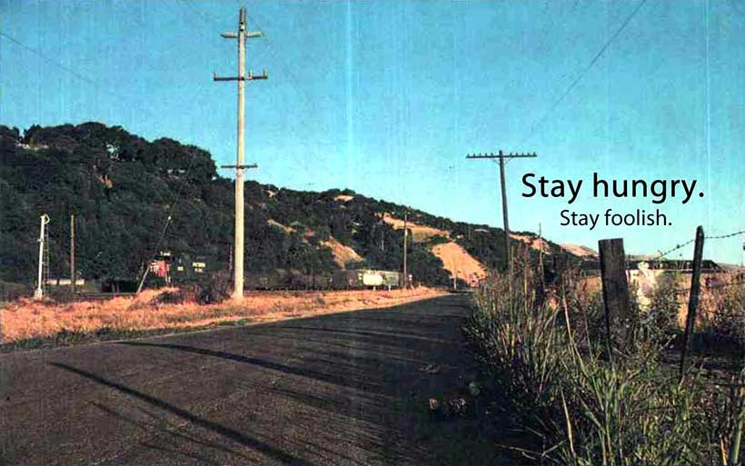

  

# Fermin Paez
**Senior Data Engineer | Data Architect**

Perfil técnico enfocado en la arquitectura de datos, optimización de recursos (FinOps) y diseño de pipelines distribuidos de alta disponibilidad.

## Sobre mí

- **Enfoque actual:** Transición a Data Architect, diseño de arquitecturas escalables y estructuración de datos.
- **Hitos técnicos recientes:**
  - **Arquitectura RAG & IA Local:** Diseño de sistema RAG para un grupo de noticias (scrapers en Python, *chunking* en Markdown y Redis). Despliegue de un LLM *on-premise* sobre hardware legacy reutilizado para motorizar inferencias, eliminando costos de APIs externas.
  - **Procesamiento Distribuido:** Diseño de pipelines analíticos utilizando **Apache Kafka** para la ingesta de eventos, **Apache Flink** para transformaciones *stateful* de baja latencia y **Apache Spark** para procesamiento *batch* e históricos.
  - **Modelado y Orquestación:** Desarrollo de flujos con **Apache Airflow** y **dbt**, implementando arquitectura Medallion y modelado dimensional (esquema en estrella de Kimball).
  - **FinOps & Cloud:** Optimización de costos de almacenamiento mediante la migración estratégica de datasets masivos desde BigQuery hacia Google Cloud Storage.
- **Entorno:** Administración de entornos aislados (macOS como estación principal y entornos Windows dedicados para cargas específicas).

## Stack Tecnológico

### Lenguajes y Bases de Datos
     

### Procesamiento de Datos y Orquestación
    
